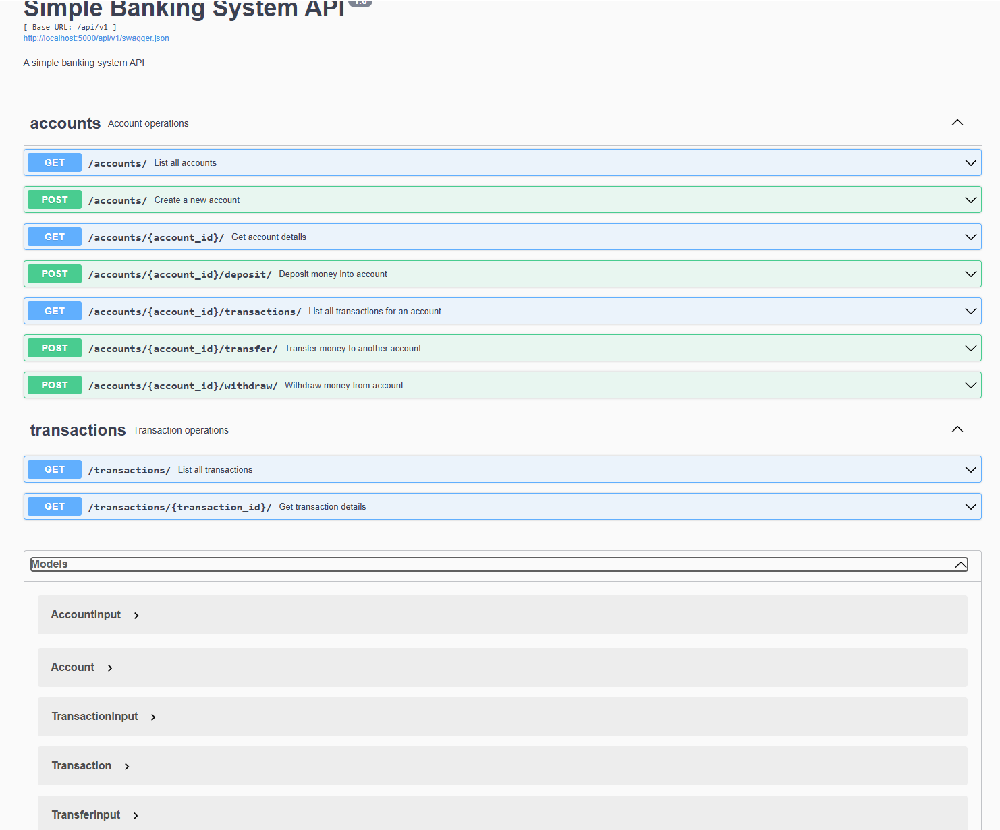

# Simple Banking System

A RESTful API for a simple banking system built with Flask and Flask-RESTX.

## Table of Contents

- [Features](#features)
- [Prerequisites](#prerequisites)
- [Setup](#setup)
- [API Documentation](#api-documentation)
- [System Architecture](#system-architecture)
- [Project Structure](#project-structure)
- [Testing](#testing)
- [Design Principles](#design-principles)
- [Future Enhancements](#future-enhancements)

## Features

- Account management (create, read)
- Transaction processing (deposits, withdrawals)
- Transaction history tracking
- RESTful API with Swagger documentation

## Prerequisites

- Python 3.7 or higher
- Docker (optional, for containerized deployment)

## Setup

### Option 1: Using Docker (Recommended)

```powershell
docker-compose up --build
```

The API will be available at http://localhost:5000

### Option 2: Local Development

```powershell
# Create and activate virtual environment
python -m venv venv
.\venv\Scripts\activate

# Install dependencies
pip install -r requirements.txt

# Set environment variables
$env:FLASK_APP = "SimpleBankingSystem"
$env:FLASK_ENV = "development"

# Create data directory
mkdir data

# Run the application
flask run
```

Note: Always make sure you're in the virtual environment (you should see `(venv)` at the start of your prompt) before running any Python commands.

## API Documentation

To verify that all dependencies are installed correctly:

```powershell
# Check Flask installation
python -c "import flask; print(flask.__version__)"

# Check Flask-RESTX installation
python -c "import flask_restx; print(flask_restx.__version__)"

# Check pytest installation
python -c "import pytest; print(pytest.__version__)"

# Check coverage installation
python -c "import coverage; print(coverage.__version__)"
```

## API Documentation

The API documentation is defined in `SimpleBankingSystem/api.py` using Flask-RESTX. It includes:

- API models and schemas
- Endpoint documentation
- Request/response examples
- Parameter descriptions

Access the interactive Swagger documentation at:

```
http://localhost:5000/api/v1/swagger/
```

The documentation is automatically generated from the API definitions in `api.py` and includes:

- Account operations (create, read, deposit, withdraw, transfer)
- Transaction operations (list, details)
- Health check endpoint
- Request/response models



## System Architecture

### Command Pattern

The system uses the Command pattern to encapsulate banking operations:

```python
class BaseCommand(ABC):
    @abstractmethod
    def execute(self, accounts: Dict[str, BankAccount]) -> Dict[str, Any]:
        """Perform the command action."""
        pass

    def save_state(self, accounts: Dict[str, BankAccount]):
        """Save the current state of all accounts to CSV files."""
        pass
```

### Key Features

1. **Command Pattern**

   - Encapsulates operations as objects
   - Supports undoable operations
   - Enables command queuing and logging
   - Provides uniform interface for all operations

2. **State Management**

   - Transaction states: PENDING → PROCESSING → COMPLETED/FAILED
   - Immutable completed transactions
   - Retry mechanism for failed transactions
   - Thread-safe operations

   State Transition Flow:

   ```
   [*] --> PENDING: Transaction Created
   PENDING --> PROCESSING: Start Processing
   PENDING --> COMPLETED: Direct Completion
   PENDING --> FAILED: Validation Failed
   PROCESSING --> COMPLETED: Success
   PROCESSING --> FAILED: Processing Error
   FAILED --> PENDING: Retry
   COMPLETED --> [*]: Final State
   ```

3. **Memory Management**

   - In-memory transaction queue
   - Automatic archiving of completed transactions
   - CSV-based persistence
   - Efficient resource usage

   System States Persistence:

   - Accounts Data: Stored in `data/accounts.csv`
   - Active Transactions: Stored in `data/transactions.csv`
   - Archived Transactions: Stored in `data/archived_transactions.csv`

   Transaction Processing Paths:

   - Fast Path: Transactions are appended to an in-memory queue for quick processing
   - Slow Path: Sorting and ordering are deferred to reporting/archiving operations

4. **Concurrency Control**
   - Account-level locking
   - Thread-safe operations
   - Parallel processing for different accounts

## Project Structure

```
.
├── .dockerignore           # Docker ignore file
├── .gitattributes          # Git attributes
├── .gitignore             # Git ignore file
├── Dockerfile             # Docker configuration
├── README.md              # Project documentation
├── assets/                # Documentation assets
├── data/                  # Data storage directory
│   ├── accounts.csv           # Account data
│   ├── transactions.csv       # Active transactions
│   └── archived_transactions.csv # Archived transactions
├── docker-compose.yml     # Docker compose configuration
├── requirements.txt       # Python dependencies
├── setup.py               # Package setup file
└── SimpleBankingSystem/   # Main application package
    ├── __init__.py
    ├── api.py             # API routes and documentation
    ├── app.py             # Flask application factory
    ├── commands.py        # Command pattern implementation
    ├── commands/          # Command implementations
    ├── config.py          # Application configuration
    ├── constants.py       # System constants and enums
    ├── entities.py        # Data models
    ├── logger.py          # Logging configuration
    ├── main.py            # Application entry point
    ├── transaction_log.py # Transaction logging
    ├── utils.py           # Utility functions
    └── tests/             # Test suite
        ├── test_routes.py # API test cases
        └── test_commands.py # Command pattern test cases
```

## Testing

### Basic Test Execution

Run tests using unittest:

```powershell
# Make sure you're in the virtual environment first
.\venv\Scripts\activate
python -m unittest discover -s SimpleBankingSystem -p "test_*.py" -v
```

### Running Tests with Coverage

1. Install coverage package:

```powershell
# Make sure you're in the virtual environment first
.\venv\Scripts\activate
pip install coverage
```

2. Run tests with coverage:

```powershell
# Make sure you're in the virtual environment first
.\venv\Scripts\activate

# Run all tests with coverage
python -m coverage run -m unittest discover -s SimpleBankingSystem -p "test_*.py" -v

# Generate coverage report
python -m coverage report -m

# Generate HTML coverage report
python -m coverage html
```

3. View coverage results:

- Console report shows coverage percentage for each file
- HTML report (in `htmlcov/` directory) provides detailed line-by-line coverage
- Open `htmlcov/index.html` in browser for interactive coverage report

4. Coverage thresholds:

- Aim for at least 80% code coverage
- Focus on critical paths and business logic
- Exclude test files from coverage report

## Design Principles

1. **Immutability**: Completed transactions are immutable
2. **Thread Safety**: All operations are thread-safe
3. **Decimal Precision**: Financial calculations use Decimal
4. **Clean Architecture**: Separation of concerns
5. **State Management**: Clear transaction lifecycle

## Future Enhancements

### 1. Metrics Capture with Grafana

- System performance metrics
- Transaction processing statistics
- API endpoint monitoring
- Resource utilization tracking
- Custom business metrics dashboard

### 2. Async Statement Export with Airflow and Presto

- Scheduled statement generation
- Batch processing of transaction data
- Integration with Presto for analytics
- Airflow DAGs for workflow automation
- Export to multiple formats (PDF, CSV, Excel)
