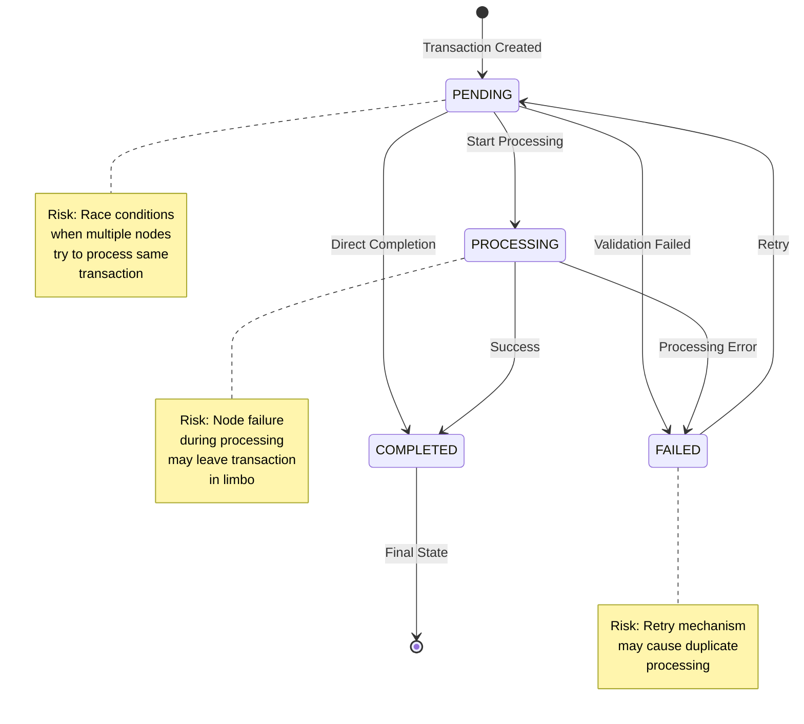

# Simple Banking System

A simple banking system API built with Flask and Flask-RESTX.

## Features

- Account management (create, read)
- Transaction processing (deposits, withdrawals)
- Transaction history tracking
- RESTful API with Swagger documentation

## Prerequisites

- Python 3.7 or higher
- Docker (optional, for containerized deployment)

## Setup

### Option 1: Using Docker (Recommended)

1. Build and run the Docker container:

```powershell
docker-compose up --build
```

The API will be available at `http://localhost:5000`

### Option 2: Local Test

1. Create a virtual environment:

```powershell
python -m venv venv
.\venv\Scripts\activate
```

2. Install dependencies:

```powershell
pip install -r requirements.txt
```

3. Set environment variables:

```powershell
$env:FLASK_APP = "SimpleBankingSystem"
$env:FLASK_ENV = "development"
```

4. Create data directory:

```powershell
mkdir data
```

5. Run the application:

```powershell
flask run
```

## API Documentation

The API documentation is available at:

```
http://localhost:5000/api/v1/swagger/
```


## API Endpoints

### Health Check

- **GET** `/api/v1/health/`
- Returns API health status

### Accounts

- **GET** `/api/v1/accounts/`
  - List all accounts
- **POST** `/api/v1/accounts/`
  - Create a new account
  - Request body:
    ```json
    {
      "name": "John Doe",
      "initial_balance": 1000.0
    }
    ```
- **GET** `/api/v1/accounts/<account_id>`
  - Get account details
- **GET** `/api/v1/accounts/<account_id>/transactions/`
  - Get account transaction history

### Transactions

- **GET** `/api/v1/transactions/`
  - List all transactions
- **POST** `/api/v1/transactions/`
  - Create a new transaction
  - Request body:
    ```json
    {
      "account_id": "account_id",
      "type": "DEPOSIT",
      "amount": 100.0
    }
    ```

## Testing the API

### Using PowerShell

1. Create a new account:

```powershell
$body = @{
    name = "John Doe"
    initial_balance = 1000.00
} | ConvertTo-Json

Invoke-RestMethod -Uri "http://localhost:5000/api/v1/accounts" -Method Post -Body $body -ContentType "application/json"
```

2. List all accounts:

```powershell
Invoke-RestMethod -Uri "http://localhost:5000/api/v1/accounts" -Method Get
```

3. Make a deposit:

```powershell
$body = @{
    account_id = "account_id"
    type = "DEPOSIT"
    amount = 100.00
} | ConvertTo-Json

Invoke-RestMethod -Uri "http://localhost:5000/api/v1/transactions" -Method Post -Body $body -ContentType "application/json"
```

4. Get transaction history:

```powershell
Invoke-RestMethod -Uri "http://localhost:5000/api/v1/accounts/account_id/transactions" -Method Get
```

## Project Structure

```
SimpleBankingSystem/
├── assets/                  # Screenshots and documentation assets
├── data/                    # Data storage directory
├── SimpleBankingSystem/     # Main application package
│   ├── __init__.py
│   ├── api.py              # API routes and endpoints
│   ├── app.py              # Flask application factory
│   ├── commands.py         # Command pattern implementation
│   ├── constants.py        # Constants and enums
│   ├── entities.py         # Domain entities
│   ├── logger.py           # Logging configuration
│   └── transaction_log.py  # Transaction logging
├── tests/                  # Test suite
├── .gitignore
├── docker-compose.yml
├── Dockerfile
├── README.md
└── requirements.txt
```

## Project Scope

### In Scope (Core Functionality)

1. **Basic Banking Operations**:

   - Account creation and management
   - Deposit and withdrawal transactions
   - Balance inquiries
   - Fund transfers between accounts

2. **Transaction Processing**:

   - State management (PENDING → PROCESSING → COMPLETED/FAILED)
   - Transaction validation and error handling
   - Retry mechanism for failed transactions
   - Thread-safe transaction processing

3. **Data Persistence**:

   - CSV-based storage for accounts and transactions
   - Basic transaction archiving
   - State recovery on system restart

4. **Command Pattern Implementation**:

   a. **CommandInvoker (Singleton)**:

   - Central controller for all banking operations
   - Manages account state and transaction processing
   - Ensures thread-safe operations through locks
   - Provides factory methods for command creation
   - Handles command execution and state persistence

   b. **CommandFactory**:

   - Creates specific command instances
   - Implements factory methods for each operation type
   - Validates command parameters before creation
   - Available commands:
     - CreateAccountCommand: Creates new bank accounts
     - DepositCommand: Handles deposit transactions
     - WithdrawCommand: Handles withdrawal transactions
     - GetBalanceCommand: Retrieves account balance
     - GetTransactionsCommand: Retrieves transaction history
     - ArchiveTransactionsCommand: Archives old transactions

   c. **BaseCommand (Abstract)**:

   - Defines common command interface
   - Required methods:
     - execute(): Performs the command action
     - save_state(): Persists state changes
   - Implements common validation and error handling
   - Provides base functionality for all commands

   d. **Command Flow**:

   1. Client requests operation through CommandInvoker
   2. CommandInvoker uses CommandFactory to create command
   3. Command executes operation with proper validation
   4. State changes are persisted
   5. Result is returned to client

### Out of Scope (Future Enhancements)

1. **Asynchronous Features**:

   - Async transaction processing
   - Background statement generation
   - Scheduled transaction archiving
   - Real-time notifications

2. **Advanced Security**:

   - User authentication and authorization
   - Role-based access control
   - Audit logging and compliance
   - Encryption of sensitive data

3. **Advanced Monitoring**:

   - Performance metrics collection
   - Alerting and notification system

4. ** CI/CD **
   - Github action on merge to test/deploy
   - communicate with Clous Platform

## Transaction State Management

The system implements a robust transaction state management system with the following principles:

### State Transition Flow

```mermaid
    [*] --> PENDING: Transaction Created
    PENDING --> PROCESSING: Start Processing
    PENDING --> COMPLETED: Direct Completion
    PENDING --> FAILED: Validation Failed
    PROCESSING --> COMPLETED: Success
    PROCESSING --> FAILED: Processing Error
    FAILED --> PENDING: Retry
    COMPLETED --> [*]: Final State
```

1. **Transaction States**:

   - PENDING: Initial state when a transaction is created
   - PROCESSING: Transaction is being processed
   - COMPLETED: Transaction is finalized and cannot be modified
   - FAILED: Transaction has failed and can be retried

2. **State Transition Rules**:

   - PENDING can transition to:
     - COMPLETED: Transaction is successful
     - FAILED: Transaction is invalid or rejected
   - PROCESSING can transition to:
     - COMPLETED: Transaction is successful
     - FAILED: Transaction failed during processing
   - FAILED can transition to:
     - PENDING: Transaction can be retried
   - COMPLETED is immutable and cannot be changed
   - Invalid state transitions raise a ValueError

3. **Balance Updates**:
   - Balance is only affected when a transaction reaches COMPLETED state
   - Completed transactions cannot be rolled back
   - If a mistake is made, a new transaction (reversal) should be created

## Transaction Retry Mechanism

The system implements a robust retry mechanism for failed transactions with the following features:

1. **Retry Limits**:

   - Maximum of 3 retry attempts per transaction (configurable via `MAX_TRANSACTION_RETRIES`)
   - Retry count is tracked per transaction
   - Once retry limit is reached, transaction remains in FAILED state

2. **Retry Process**:

   - Only transactions in FAILED state can be retried
   - Retry transitions transaction back to PENDING state
   - Each retry attempt increments the retry counter
   - Retry attempts are logged for monitoring

3. **Error Handling**:

   - Invalid retry attempts (e.g., retrying a completed transaction) raise ValueError
   - Retry limit exceeded raises ValueError with appropriate message
   - All retry operations are thread-safe using locks (just demoing, no destributed consistency gauranteed on multiple nodes)

4. **Implementation**:

   ```python
   def retry(self) -> bool:
       if self.txn_status != TransactionStatus.FAILED:
           raise ValueError(f"Cannot retry transaction in {self.txn_status} state")

       if self.retry_count > self.max_retries:
           raise ValueError("Maximum retry count reached")

       self.retry_count += 1
       return self.state_machine.transition(TransactionEvent.RETRY)
   ```

5. **Best Practices**:
   - Monitor retry counts for potential issues
   - Implement exponential backoff for retry attempts
   - Log all retry attempts for auditing
   - Consider transaction age when deciding to retry

## Distributed System Considerations

### State Transition Risks in Distributed Environment



## Architecture

The system follows a command-based architecture with the following components:

1. **Entities**:

   - BankAccount: Represents a bank account with balance and transactions
   - Transaction: Represents a financial transaction with state management

2. **Commands**:

   - CreateAccountCommand: Creates a new bank account
   - DepositCommand: Handles deposit transactions
   - WithdrawCommand: Handles withdrawal transactions
   - GetBalanceCommand: Retrieves account balance
   - GetTransactionsCommand: Retrieves transaction history
   - ArchiveTransactionsCommand: Archives old transactions

3. **State Management**:
   - Each transaction maintains a single record that gets updated through its lifecycle
   - Status changes from PENDING → PROCESSING → COMPLETED
   - Balance is only affected when status becomes COMPLETED
   - Transactions are sorted only during archiving or statement generation

## Getting Started

1. Clone the repository
2. Install dependencies: `pip install -r requirements.txt`
3. Run tests: `python -m unittest discover tests`

## Testing

The system includes comprehensive tests covering:

### Account Management

- Account creation with valid parameters
- Account creation validation:
  - Can create account with zero balance
  - Cannot create account with negative balance
  - Cannot create account with empty name
  - Initial balance must be in whole cents
- Account ID immutability
- Account balance validation

### Transaction Processing

- Deposit operations:
  - Valid deposit amounts (must be positive)
  - Invalid deposit amounts (zero or negative)
  - Decimal precision validation (must be whole cents)
- Withdrawal operations:
  - Valid withdrawal amounts (must be positive)
  - Overdraft prevention
  - Insufficient funds validation
- Transfer operations:
  - Valid transfers between accounts
  - Self-transfer prevention
  - Insufficient funds validation
  - Transfer amount validation (must be positive)

### State Management

- Transaction lifecycle:
  - PENDING → PROCESSING → COMPLETED
  - PENDING → PROCESSING → FAILED
  - FAILED → PENDING (retry)
- Invalid state transitions:
  - Cannot complete a pending transaction
  - Cannot fail a pending transaction
  - Cannot retry a completed transaction
  - Cannot process a completed transaction

### Concurrency

- Thread-safe balance access
- Concurrent transaction processing
- Lock mechanism validation

### Data Persistence

- CSV file operations:
  - Account data persistence
  - Transaction data persistence
  - State recovery on restart
- Transaction archiving:
  - Archive file creation
  - Transaction sorting
  - Keep-last functionality

### Edge Cases

- Zero amount transactions
- Maximum retry attempts (3)
- Transaction ordering by timestamp
- Transaction list immutability

Run tests with: `python -m unittest discover -s SimpleBankingSystem -p "test_*.py" -v`

## Design Principles

1. **Immutability**: Completed transactions are immutable to prevent data corruption
2. **Thread Safety**: All operations are thread-safe using locks
3. **Decimal Precision**: Financial calculations use Decimal for precise arithmetic
4. **Clean Architecture**: Separation of concerns between layers
5. **State Management**: Clear transaction lifecycle with immutable completed state

# Command Design Pattern Implementation

## Overview

The banking system implements the Command design pattern to encapsulate all banking operations as objects. This pattern provides several benefits:

- Decouples the object that invokes the operation from the one that knows how to perform it
- Supports undoable operations
- Enables command queuing and logging
- Provides a uniform interface for all banking operations

## Key Components

### 1. Base Command Interface

```python
class BaseCommand(ABC):
    @abstractmethod
    def execute(self, accounts: Dict[str, BankAccount]) -> Dict[str, Any]:
        """Perform the command action."""
        pass

    def save_state(self, accounts: Dict[str, BankAccount]):
        """Save the current state of all accounts to CSV files."""
        pass
```

### 2. Concrete Commands

- `CreateAccountCommand`: Creates new bank accounts
- `DepositCommand`: Handles money deposits
- `WithdrawCommand`: Manages withdrawals
- `TransferCommand`: Processes transfers between accounts
- `ArchiveTransactionsCommand`: Archives old transactions
- `RetryTransactionCommand`: Retries failed transactions

### 3. Command Invoker (Singleton)

```python
class CommandInvoker:
    _instance = None

    def __new__(cls):
        if cls._instance is None:
            cls._instance = super(CommandInvoker, cls).__new__(cls)
            cls._instance.accounts = load_accounts()
            cls._instance.factory = CommandFactory()
        return cls._instance
```

### 4. Command Factory

```python
class CommandFactory:
    @staticmethod
    def _create_account(name: str, initial_balance: Decimal) -> CreateAccountCommand:
        # Factory method implementation
        pass
```

## Design Features

### 1. Singleton Pattern

- `CommandInvoker` is implemented as a singleton to ensure:
  - Single point of access to banking operations
  - Consistent state management
  - Efficient resource usage (accounts loaded only once)

### 2. State Management

- Each command is responsible for:
  - Executing the operation
  - Saving state changes
  - Handling errors and rollbacks

### 3. Thread Safety

- Commands use locks to ensure thread-safe operations
- Singleton pattern provides thread-safe access to the invoker

### 4. Error Handling

- Commands validate inputs before execution
- Failed operations are properly rolled back
- Transaction state is maintained consistently

## Usage Example

```python
# Create invoker (singleton)
invoker = CommandInvoker()

# Create account
account = invoker.create_account("John Doe", Decimal("100.00"))

# Perform operations
invoker.deposit(account['account_id'], Decimal("50.00"))
invoker.withdraw(account['account_id'], Decimal("25.00"))
```

## Benefits

1. **Encapsulation**: Each command encapsulates a specific banking operation
2. **Extensibility**: New commands can be added without modifying existing code
3. **Maintainability**: Clear separation of concerns between command creation and execution
4. **Reliability**: Consistent state management and error handling
5. **Performance**: Efficient resource usage through singleton pattern
